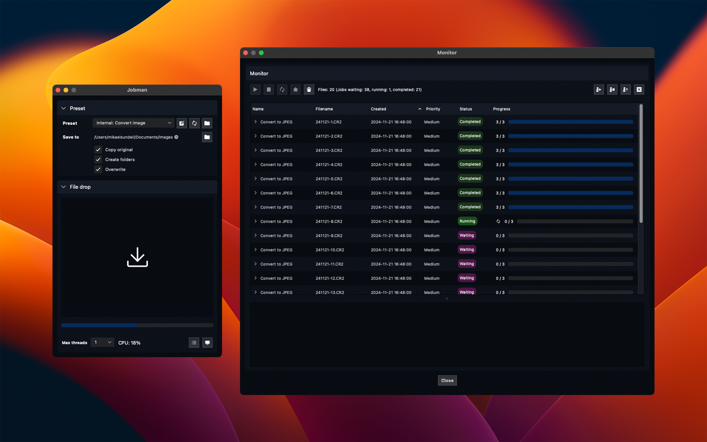

#  Jobman: Batch Processing #

[](https://github.com/mikaelsundell/jobman/blob/master/README.md)

Table of Contents
=================

- [ Jobman: Batch Processing](#-jobman-batch-processing)
- [Table of Contents](#table-of-contents)
  - [Introduction](#introduction)
  - [Documentation](#documentation)
    - [Preset fields](#preset-fields)
    - [Option fields](#option-fields)
  - [Web Resources](#web-resources)
  - [Copyright](#copyright)
  
Introduction
------------



Jobman is a user-friendly Mac and Windows application designed for batch processing files according to predefined job descriptions. It enables the creation of tool chains for drag-and-drop processing, streamlining workflows for efficiency and ease of use. The application boasts a straightforward drag-and-drop interface for file submission, monitoring and job control.

<a href="https://apps.apple.com/se/app/jobman-batch-processing/id6738392819?l=en-GB&mt=12" target="_blank" style="cursor: pointer;">
    
</a>

Documentation
-------------

**Introduction**

Jobman is a tool designed to manage and monitor processing tasks with customizable presets and user-defined parameters. It features a main interface for configuring tasks and a monitor interface for managing job execution.

**The Jobman main interface**

- **Preset**: Select or define the current preset configuration for processing.
- **Save to**: Specify the output directory where processed files will be saved.
- **Copy original**: Enable this option to copy the original (unprocessed) files to the output directory.
- **Create folders**: Automatically create a new folder in the output directory for processed files.
- **Overwrite**: Allow overwriting of existing files. The preset task output must be explicitly configured for this option.
- **Max threads**: Define the number of threads to use for processing tasks, optimizing performance based on available system threads.

**The jobman monitor interface**

The monitor interface provides tools for controlling and prioritizing jobs.

-  **Start**: Begin processing for selected jobs that are currently stopped.
-  **Stop**: Halt the execution of selected jobs.
-  **Restart**: Restart selected jobs from the beginning.
-  **Priority**: Adjust the priority level for selected jobs, influencing the order in which they are processed.

**Quick start**

Begin by selecting a preset, then drag and drop your files onto the designated file drop area within Jobman. The application will automatically commence processing your files in accordance with the chosen preset's specifications and associated tasks.

**Understanding preset file format**

A preset file articulates a sequence of tasks to be executed during file processing. It allows for the specification of commands, file extensions, arguments, and initial directories. Additionally, it supports the definition of dependencies among tasks using the dependson attribute, enabling complex processing chains.

Here's an example of a preset file format, tailored for converting image files on the Mac:


```json
{
    "id": "convertimage",
    "name": "Internal: Convert image",
    "type": "file",
    "options": [
      {
        "id": "jpegquality",
        "name": "JPEG Quality",
        "type": "Slider",
        "default": 80,
        "minimum": 0,
        "maximum": 100,
        "value": 80,
        "flag": "--setProperty formatOptions"
      },
      {
        "id": "resizewidth",
        "name": "Resize width",
        "type": "Dropdown",
        "default": "Medium",
        "options": [
          {
            "label": "Small 200px",
            "value": 200
          },
          {
            "label": "Medium 400px",
            "value": 400
          },
          {
            "label": "Large 800px",
            "value": 800
          }
        ],
        "value": "400",
        "flag": "--resampleWidth"
      },
      {
        "id": "verbose",
        "name": "Verbose",
        "type": "Checkbox",
        "default": "true",
        "value": "true",
        "flag": "--verbose"
      },
      {
        "id": "value as double",
        "name": "Double",
        "type": "Double",
        "default": "1.0",
        "minimum": 0,
        "maximum": 100,
        "value": "1.0",
        "flag": "--double"
      }
    ],
    "tasks": [
      {
        "id": "1",
        "name": "Convert to JPEG",
        "command": "sips",
        "extension": "jpg",
        "output": "%outputdir%/%outputbase%.%outputext%",
        "arguments": "-s format jpeg %inputfile% --out %outputfile%",
        "startin": "",
        "documentation": [
          "sips -s format jpeg inputfile --out outputfile",
          "Converts the input file to JPEG format using the sips command",
          "-s format jpeg: Specifies the format to convert to",
          "--out: Specifies the output file path"
        ]
      },
      {
        "id": "2",
        "name": "Adjust JPEG quality",
        "command": "sips",
        "extension": "jpg",
        "output": "%outputdir%/%outputbase%.%outputext%",
        "arguments": "%options:jpegquality% %outputfile%",
        "dependson": "1",
        "documentation": [
          "sips --setProperty formatOptions 80 outputfile",
          "Adjusts the JPEG quality to 80 (out of 100)",
          "--setProperty formatOptions: Sets the JPEG quality level"
        ]
      },
      {
        "id": "3",
        "name": "Generate thumbnail",
        "command": "sips",
        "extension": "jpg",
        "output": "%outputdir%/%outputbase%_thumbnail.%outputext%",
        "arguments": "%options:resizewidth% %outputdir%/%outputbase%.%outputext% --out %outputfile%",
        "dependson": "2",
        "documentation": [
          "sips --resampleWidth 200 outputfile --out thumbnailfile",
          "Generates a thumbnail by resizing the width of the pixels",
          "--resampleWidth: Specifies the width of the thumbnail",
          "--out: Specifies the output file path for the thumbnail"
        ]
      }
    ]
  }
```


**Supported variables**

Preset files support various variables that can be used to customize arguments during processing. These variables are dynamically replaced based on the context of the input and output files.

**Input variables:**

```shell
%inputdir%         Replaces with the directory path of the input file.
%inputfile%        Replaces with the full path of the input file.
%inputext%         Replaces with the file extension of the input file.
%inputbase%        Replaces with the base name (filename without extension) of the input file.
```

**Output variables:**

```shell
%outputdir%        Replaces with the directory path of the output file.
%outputfile%       Replaces with the full path of the output file.
%outputext%        Replaces with the file extension of the output file.
%outputbase%       Replaces with the base name of the output file.
```

**Options variables:**

```shell
%options:name%     Replaces the variable with the options name and its value.
```

### Preset fields

`id`
- Description: A unique identifier for the preset.
- Usage: Used internally to reference the preset.

`name`
- Description: The display name of the preset.
- Usage: This is used for user interfaces or logging where a readable name is required.

`type`
- Description: The type of the preset. Supported types  `file` and `command`. File presets accepts dropped files and command adds single command jobs without varying input files. Default is `file`.
- Usage: Determines how the preset behaves in the interface, either allowing file drops or presenting a command-only option.

### Option fields

`id`
- Description: A unique identifier for the option.
- Usage: Used internally to reference the option.

`name`
- Description: The display name of the option.
- Usage: This is used for user interfaces or logging where a readable name is required.

`description`
- Description: A short explanation of the option.
- Usage: Used in tooltips to provide additional context.

`flag`
- Description: The command-line flag associated with this option.
- Usage: Used to set the flag of the option.

`flagonly`
- Description: A toggle flag for enabling use of the "flag only" without the value.
- Usage: Used to provide "flag only" arguments.

`type`
- Description: Specifies the ui type of the option. Supported types `double`, `doubleslider`, `dropdown`, `file`, `int`, `intSlider` and `text`.
- Usage: Used as user interface control to present the option.

`value`
- Description: The current value assigned to this option.
- Usage: This field represents the actual selected or set value.

`default`
- Description: The default value assigned if no user value is provided.
- Usage: Used to reset to default settings.

`minimum`
- Description: The minimum allowed value for the option.
- Usage: Used for validation to prevent values below this threshold.

 `maximum`
- Description: The maximum allowed value for the option.
- Usage: Used for validation to prevent values exceeding this threshold.

 `toggle`
- Description: A toggle switch used to turn the option on or off.
- Usage: This field conditionally enables or disables the option based on its state.

**Task variables**

```shell
%task:input%       Substitutes the task input, which defaults to the dependent task output, or inputfile if no dependent task exists.
%task:output%      Substitutes the output of the dependent task.
```

Each variable is designed to simplify the scripting and automation within preset configurations, ensuring that file paths and details are handled efficiently without manual specification in every command.

Web Resources
-------------

* GitHub page:        https://github.com/mikaelsundell/jobman
* Issues              https://github.com/mikaelsundell/jobman/issues

Copyright
---------

**3rdparty libraries acknowledgment and copyright notice**

This product includes software developed by third parties. The copyrights and terms of use of these third-party libraries are fully acknowledged and respected. Below is a list of said libraries and their respective copyright notices:

App icon: Copyright flaticon.com

The Qt Company Ltd.: Copyright (C) 2016 by The Qt Company Ltd. All rights reserved.

The use of the above-mentioned software within this product is in compliance with the respective licenses and/or terms and conditions of the copyright holders. The inclusion of these third-party libraries does not imply any endorsement by the copyright holders of the products developed using their software.

